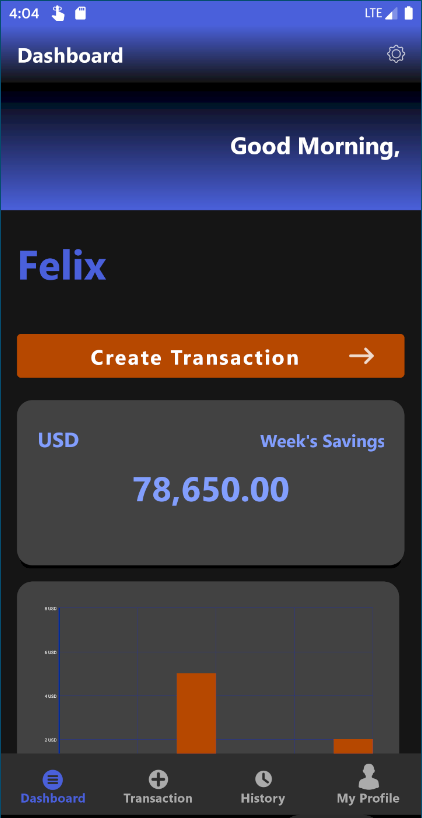
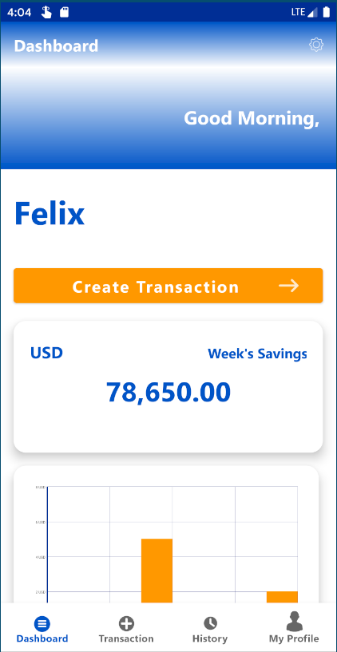

# Mobotithe

## Business Logic
**Mobotithe** is an android application for keeping tab of Transactions (essentially, Incomes and Expenses) based on a specific interval provided by the user. Your data is accessible anywhere as long as you are connected to the internet. Your data also saves to your phone's local storage and is updated when an internet connection is noticed.

## Functionalities in Images

- ### Add Transaction Categories

Transaction Categories are added so as to specify the type of transaction that is been recorded, They contain three properties: `name` , `interval`, `defaultAmount`.

- ### Add Transaction
Here, you select the Transaction Category and add the amount, or the default amount is submitted.

## The app features a Dark Mode for Battery saving and Dark Theme Lovers! :wink:

- ### Dark Theme

- ### Light Theme

Download the **[app](https://github.com/felixfavour/Mobotithe/raw/master/resources/mobotithe.apk)** :arrow_down:
